# Improved appearance 
- print out not only opt, but also parameters from argparse from the sh file
  - Split line using regexp, that every parameter name starts with a minus sign. If it is a binary parameter (there is the next parameter with a minus sign), then just paste True or False in the column of values
- Draw a vertical line to split mini-batches one from each other
- Enable single seed loss output
- 

# Resultative improvements
- Organize special files with different if-else conditions for every step in training: 
  * prepare input data 
  * preparing output data
  * prepare Dataset output
- Compare center of masses for first 2500 point clouds, if it makes sense to subtract mean for them
# Automate manual postprocessing
- Render multiple md files as a single (useful for long tables)
- Synchronize plot output between devices to consolidate them together, but ignore large files, like the model, vector output, etc. 
- 
# Tips from meeting on 21.12.2021
- Regress only 6 elements of the upper-triangular matrix, which contains information about the pose. For every seed calculate second moments (MatLab script for normalization on canonical view). For the other views, firstly rotate the point cloud at exactly 10 degrees.
- At this configuration, the axis of rotation is vertical, so that one pose angle is fixed, and the other is incremented for rotation. Then calculate the second-moment matrix. After that ask network to regress the pose directly from images, as just 6 values in the output. Alternatively, one can try to regress two angles directly.
- The next step is to include information about the center of masses of the point cloud, this will be additionally 3 parameters.
- After this works with small latent space like 2 or 4, increase shape space.
- Basis function should be smoother
- Check what is 0,0,0 of every point cloud. Is it not the camera center?
- What is the vector towards the center of masses?
- Try to output 9 seeds (3x3)
- Show seed with most elongated part
- Plot legend, what is ground truth, and what is model output
# Plan for 14.01, 15.01, 17.01
- Prepare update report for 17.01
- Automatize several things to make update reports faster
  - Find csv2md on python
  - Save as a postprocessing file with functions to produce output automatically
  - 
- 
# Update report
## e066/000w - Ground truth from original point cloud

POse ground truth are just moments (X*X, X*Y, ... , Z*Z), calculated from the original point cloud without subtracting the mean, and without calculating eigenvalues 

parameter | value
--- | :---:
bs|15
num_input_images|1
framelim|2000
rescale|500
cencrop|700
outputt|pose6
criterion|L1
lr|1e-4
hidden_dim|6
inputt|img
lb|pose6
zero_angle|
csvname|598csv9
parallel|torch
machine|workstation
.png)

## e066/001w
parameter | value
--- | :---:
bs|15
num_input_images|1
framelim|**2500**
rescale|500
cencrop|700
outputt|pose6
criterion|**L2**
lr|**5e-5**
steplr|**20, 0.2**
hidden_dim|6
inputt|img
lb|pose6
zero_angle|
csvname|598csv9
parallel|torch
machine|workstation
.png)

## e066/002w
parameter | value
--- | :---:
bs|15
num_input_images|1
framelim|**2500**
rescale|500
cencrop|700
outputt|pose6
criterion|**L2**
lr|**1e-3**
steplr|
hidden_dim|6
inputt|img
lb|pose6
zero_angle|
csvname|598csv9
parallel|torch
machine|workstation
.png)

## e066/005w - Ground truth is from point cloud with subtracted mean 
parameter | value
--- | :---:
bs|15
num_input_images|1
framelim|**2500**
rescale|500
cencrop|700
outputt|pose6
criterion|**L2**
lr|**1e-3**
hidden_dim|6
inputt|img
lb|pose6
zero_angle|
csvname|598csv9
parallel|torch
machine|workstation

.png)

.png)

.png)

## e066/046l
parameter | value
--- | :---:
epoch|**10**
bs|**7**
num_input_images|1
framelim|**25**
rescale|500
cencrop|700
outputt|pose6
criterion|**L2**
lr|1e-5
hidden_dim|6
inputt|img
lb|pose6
zero_angle|
gttype|single_f_n
csvname|598csv9
parallel|torch
machine|lenovo
Here I have spikes between iterations. The first iteration here means that the neural network has seen the first minibatch. Then the first and the second and so on. 

# Questions
- Every seed rotates relatively to the holder tip. How to find holder tip position for every seed? 
- There is a difference if calculate moments from the original point cloud or point cloud with subtracted mean.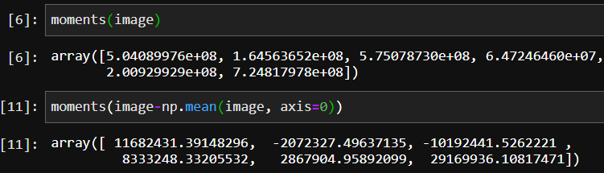 when I calculate mean, it already includes shape, because it depends on the shape, and center of masses is different from the tip position coordinate. The problem here is that I don't know the position of the tip in 3d or 2d. I only have camera center coordinates in 3d from the camera matrix. 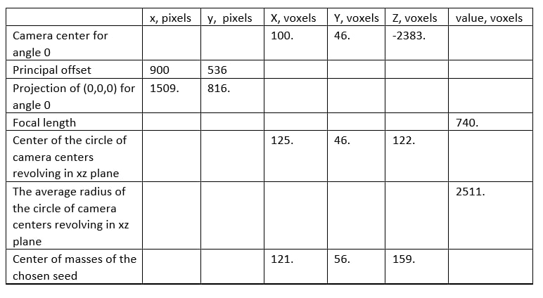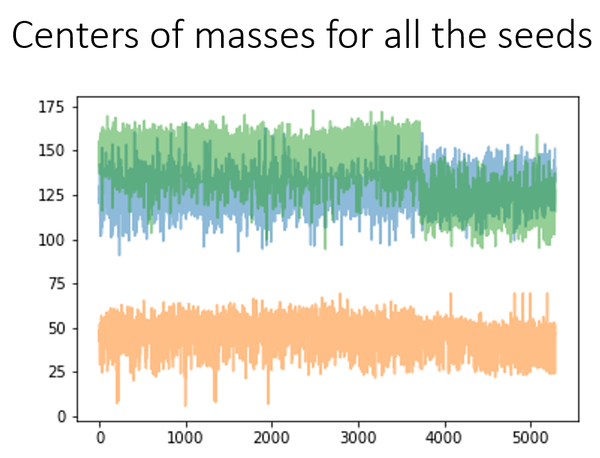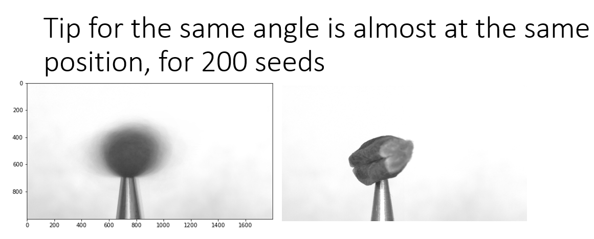
- For every rotation angle should I regress
  - pose separately for every angle, process every rotation as a new entry (data-point)
  - regress pose and then rotate it on the known angle, and then calculate loss from the GT
- Should I regress 6 values directly from moments (X*X, X*Y, ..., Z*Z), or calculate the rotation matrix from finding eigenvalues? 

# Hanno tips on 17.01.2022
- Reconstruct not (XX, XY, ..), because it depends on size, but orientation matrix, gained from the decomposition of this matrix. 
  - Check How many points of freedom it has. It should be only 3, 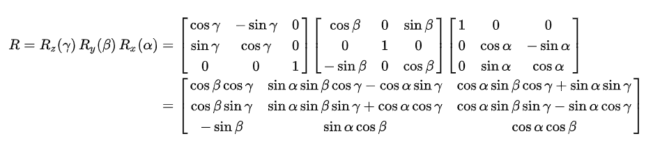, because 3 angle can describe every rotation. Another assumption, that the matrix is antisymmetrical. Is it? Or orthogonal?
  - Then try to add center of masses.
- Ask Andreas Fischbach to get the source code, how were point clouds generated. 
- If it find center and pose, it can do shape. Finally, 3D loss should include pose (and center of masses) loss
- Reread the article "What shape are dolphins". Classical fitting. 
  - Check how they track nose, flug, spine
- Check information about center of masses distribution, camera center distribution for the first 2500 seeds
- In 2. you may want to test, if using separate networks with shared weights -- one per image -- till the latent space and then joining them for pose regression may work better.

\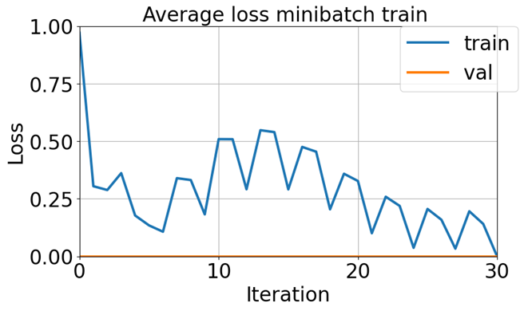

# TODO from 18.01.2022 till 24.01.2022
- **Done** Use decomposed eigenvalues matrix as ground truth for regression of the pose from images
- **Done** Treat every rotation image as separate datapoint
- **in progress** Regress pose and center of masses from images
  - Shift point cloud to have it projected with the same projection matrix on every corresponding image.
- using separate networks with shared weights -- one per image -- till the latent space and then joining them for pose regression
- 
  - 
***
#Update report for 24.01.2022

## What was done
- Implement work with multiple images with color and batch channel
- Sort eigenvalues in ascending order to save them in the same way for different seeds
- Multiply orientation matrix on sign of determinant, to have the same sign of the matrix for different seeds
- Find calculation error, when trying to get **arcsin** from 1.0000000001.
- Orientation matrix consisting of eigenvectors is orthogonal.

Algorithm for Euler angles calculation from point cloud
- Subtracting mean
- Calculating coefficients of quadric form (X*X, X*Y, .., Z*Z)
- Calculating eigenvalues
- Sort eigenvalues and return corresponding matrix of eigenvectors
- Optionally for multiple views: divide matrix of eigenvalues by rotation matrix of corresponding angle
- Calculate Euler angles from matrix of eigenvectors to use them for GT
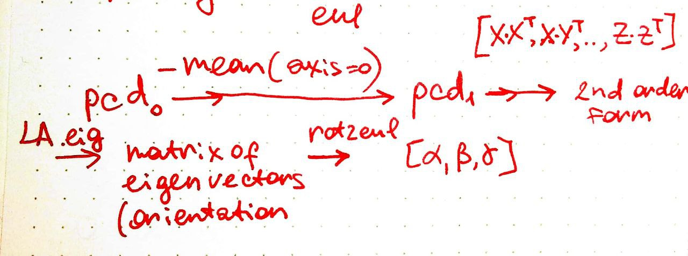

Rotation matrix from projection matrix consists of just from rotation around angle beta. 
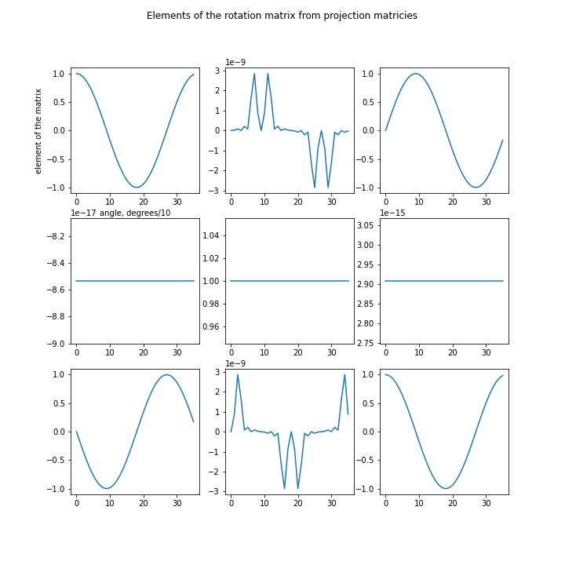

Angles of orientation distributed differently, but there is big group that takes majority of orientations. 
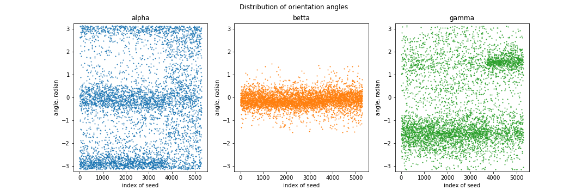

['C:/circles/finetune_test/main.py', '-epoch', '1000', '-bs', '15', '-num_input_images', '1', '-framelim', '2500', '-rescale', '500', '-cencrop', '700', '-criterion', 'L1', '-localexp', '', '-lr', '1e-4', '-expnum', 'e066', '-hidden_dim', '3', '-inputt', 'img', '-outputt', 'eul', '-lb', 'eul', '-minmax_fn', 'min,max', '-zero_angle', '-gttype', 'single_f_n', '-csvname', '598csv9', '-parallel', 'torch', '-machine', 'lenovo', '-wandb', '', '-merging_order', 'color_channel', '-updateFraction', '0.25', '-steplr', '1000', '1', '-batch_output', '2', '-cmscrop', '0', '-weight_decay', '0', '-print_minibatch', '1']

parameter | value
--- | :---:
inputt|   img 
num_input_images  |   1 
outputt  |   eul 
lb  |   eul 
minmax_fn  |   min,max 
framelim  |   2500 
criterion  |   L1 
lr|   1e-4 
hidden_dim  |   3 
zero_angle |
updateFraction  |   0.25 

## e067/008w
parameter | value
--- | :---:
inputt|   img 
num_input_images  |   **3**
outputt  |   eul 
lb  |   eul 
minmax_fn  |   min,max 
framelim  |   **-** 
criterion  |   **L2** 
lr|   1e-4 
hidden_dim  |   3
merging order | **color_channel**
updateFraction  |   0.25
ellapsed time | 10 hours
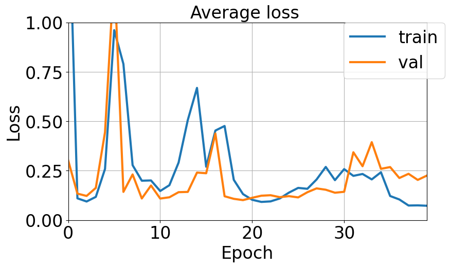
.png)

## e067/009w
parameter | value
--- | :---:
criterion | L1
lr | 1e-5
ellapsed time | 11 hours
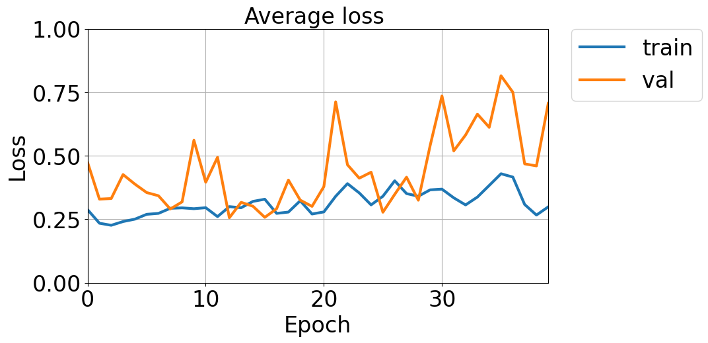

## e067/010w
parameter | value
--- | :---:
num_input_images | 6
criterion | L1
ellapsed time | 1 day 7 hours

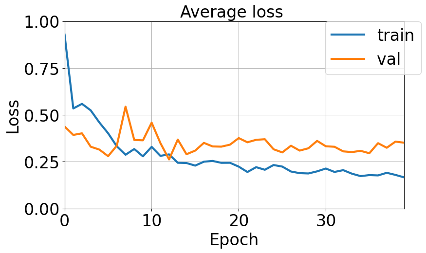

## e067/011w
parameter | value
--- | :---:
num_input_images | 12
criterion | L1
ellapsed time | in progress

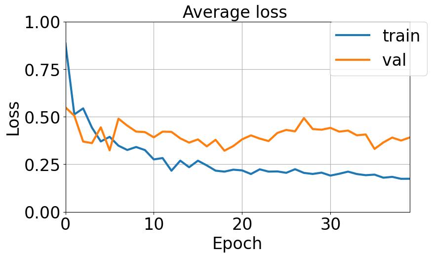

# TODO from 24.01 to 31.01
- using separate networks with shared weights -- one per image -- till the latent space and then joining them for pose regression
- Regress pose and center of masses from images
  - Shift point cloud to have it projected with the same projection matrix on every corresponding image.

# Question to Hanno

- Does it make sense to regress ellipsoid from the images? Is it the same problem, as to regress 3 values for the pose, and 3 for the coordinate of the center
- Does it make sense to try regress pose from point cloud? It would be just a single matrix learn.

## Appendix

###TODO check that multiplication of rotation matrix C on orientation matrix will give the same result, as multiplication of C by point cloud. 

Sort eigenvalues to make them in ascending order. 

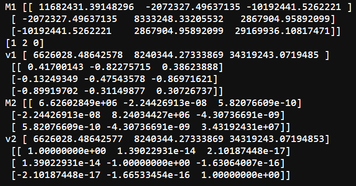

Multiply by determinant sign to make orientation uniform
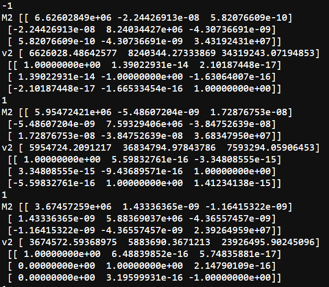
For angle alpha there is weird plot 
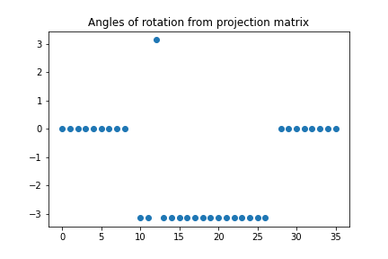
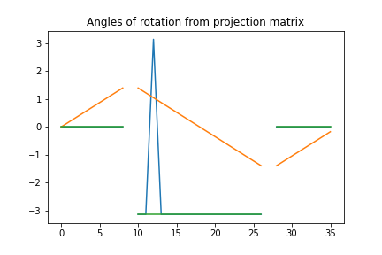

 Measured statistic for rotation angles for 598: min, max, mean, std: 
 array([-3.14159265, 3.14159265, -0.31063423, 1.48487897])

Found that it is the same to first subtract mean and then rotate, or first rotate point cloud and then subtract mean. 

It is not the same, if calculate orientation matrix from rotated point cloud. 

-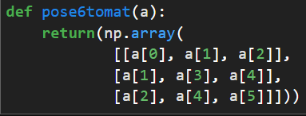 is it ok, or antidiagonal elements should be not the same
- Determinant of orientation matrix is -1

# Hanno's tips on 24.01
- Permute GT vectors, as NN can accidentially flip axes. 
- If regress eul angles, take into account peridiocity. That -pi = 0 = pi for directions.
  - if regress 3x3 orientation matrix, multiplication on -1 should be the same.
  - Look how found minimum angles between two rays.
  - Pay attention, that eigenvectors is not orientation. We need orientation, not direction. So ray has two ends. 
- When evaluate model and regress 3x3 matrix, estimate closest orthogonal vector basis, because model output is not orthogonal
  - Calculate closest orthogonal during training can be computationally expensive
- Treat independent datapoints (in batch channel). Concatenate output of the network in last convolutional output of the network. Or in the first FC layer. Add additional FC layer of size 32 or 128, for example. 
- For ellipsoid fitting, read Direct least square fitting of ellipses https://ieeexplore.ieee.org/document/765658

# Update report for 31.01.2022
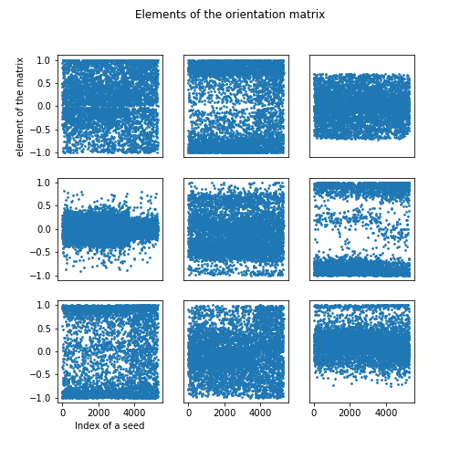

Applied augmentation:
- Multiply 3x3 orientation matrix on -1. 
- Permute columns
- Calculate the closest set of vectors, making an orthonormal matrix. 

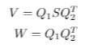
`  peridx = np.array([[0, 1, 2], [0, 2, 1], [1, 0, 2],
            [1, 2, 0], [2, 0, 1], [2, 1, 0]])`

    outputs2 = t.matmul(t.svd(outputs[j, :,:])[0], t.svd(outputs[j, :, :])[2].T)
    for i in range(12):
        outputs3 = (-1) ** (i % 2) * outputs2[:, peridx[i // 2, :]]

It takes 0.1 seconds for minibatch with size 5 and 3 views to calculate validation loss with augmentation. 
# e067/016w
parameter | value
--- | :---:
bs | 15
'-num_input_images' | '3'
'-framelim' | '6000'
'-criterion' | 'L2'
'-lr' | '1e-4'
'-hidden_dim' | '9'
'-inputt' | 'img'
'-outputt' | 'orient'
'-machine' | 'workstation'
'-merging' | 'color'
'-updateFraction' | '0.25'
'-aug_gt' | 'orient'
['-epoch', '40', '-bs', '15', '-num_input_images', '3', '-framelim', '6000', '-criterion', 'L2', '-localexp', '', '-lr', '1e-4', '-expnum', 'e067', '-hidden_dim', '9', '-inputt', 'img', '-outputt', 'orient', '-lb', 'orient', '-no_loadh5', '-minmax_fn', '', '-parallel', 'torch', '-machine', 'workstation', '-merging', 'color', '-aug_gt', 'orient', '-updateFraction', '0.25', '-steplr', '1000', '1', '-print_minibatch', '10', '-dfname', '598frame']

Validation loss is around 0.02. 
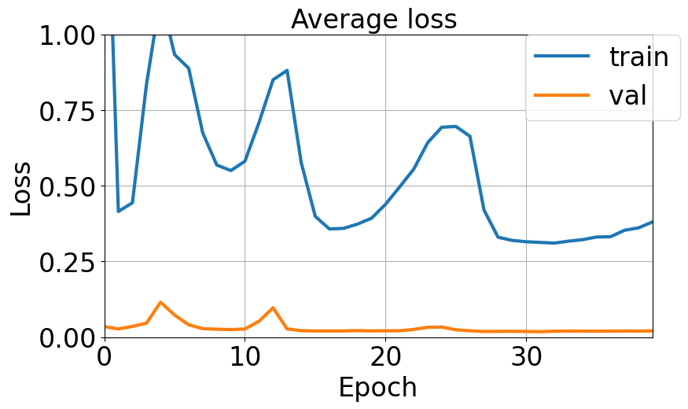
.png)

## Experiments on jureca
- Learning rate [1e-7, 5e-7, 1e-6, 5e-6, 1e-5, 5e-5, 1e-4, 5e-4, 1e-3, 5e-3]
- Num_input_images [3, 6, 9, 12, 15, 18, 21, 24, 27, 30, 36]
- Batch size [15, 20, 25, 30, 35, 40, 45, 50, 100, 200]
- [L1, L2] * [batch_merging, color_merging] * [update_fraction = 0.1, update_fraction = 0.25]

Typical learning curve

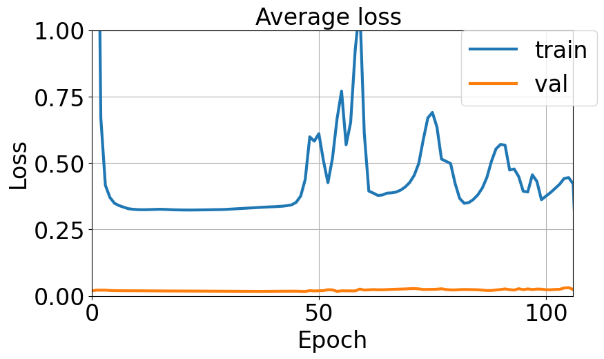
Minimum train is around 0.3, validation is around 0.02. 

## Failed experiments
### lr = 5e-3
.png)
### lr = 1e-3
.png)

### lr = 5e-4
.png)

### lr = 5e-5, update_fraction decreased from 0.25 to 0.1
.png)

### lr = 5e-5, update_fraction is decreased from 0.25 to 0.1, loss_fn changed from L2 to L1
.png)

For experiment with multiple views, one should decrease batch size, otherwise there are not enough memory
# TODO
- Copy name of the sh file to the output folder to stop saturated training
- How to save output loss figure when using multiple GPUs?
- Write callback to automatically stop saturated training
- automatically delete folders with failed experiments
- Save and synchronize loss using numpy savetxt.
- Run experiment, 
  - if with more images I have better regression of the pose
  - If increasing size of one before last FC layer is better
  - Try to regress center of masses.
# Questions to Hanno:
- Can I just use min((loss(outputs, GT), loss(outputs, -GT))) in validation?
- Should I use fixed augmentation for validation loss calculation or it is free? 
- Writing a report for JSC
- How to technically share weights?
- When regress center of mass, should I also include loss for the pose?
- Whom to ask to optimize script to work on multiple GPUs?
- 
# Plan from 01.02 till 07.02
- Regress centers of masses
- Modify FC layer size for pose regression

scaling and 
Scaling matrix by factor of 2, keep other fixed, S = diag(2, 1, 1)
Point x is being 3d point, coordinate system of the camera, 
seed is not oriented in camera direction, but rotated. 
If we have this scaling, to calculate x', that x'= R.T * S * R * x, 
vector x is projected to the three unified vectors of coordinate system of the seed. X is diagonal matrix, we require main axis of the seed to be the first eigenvalue of that matrix, the first horizontal vector in R. Is coordinate vector along the main axis of the seed. 

R is horizontal vectors, three horizontal vectors, Unit vectors, the vector, they are unit length. 
R*x is the projection to the new eigensystem. Then it is scaling, (multiply by S), then transform back.
R for rotation
R 

Requirements for 
- right handed / left
- positive half-space
Vectors of rotation.
- .X is vertical 
- If it is on the unit sphere, it should be les than 1. If vector is in the positive half-space, the sign. 
- X component is positive. Flip the whole vector if it is negative. 
- The same test. If the first is not positive, flip. 
- For the third right handed eigensystem. 
- cross product of the first two, then scalar product of the x3, if it is not negative projection 
v = (x3, [x1, x2]). if v is positive, keep x3 as is, and if v is negative, flip. 

# Hanno's tips 31.01.2022
- Flip vectors separately from each other, not the multiplication of the whole matrix by -1. 
- Take care when it is close to the flipping point. Check sign of projection (x3, [x1, x2]) in order to decide flip sign or not. 
- Check, whether validation loss is smaller if use only sign flip. One can flip signs every time depending on the output of the NN. 
- In order to get rid of values more than one, use tanh on the last layer, that actual output will be always at [-1, 1] range.
- Fix vector order. 
- Seeds are flat. Make sure that training data only contain flat systems. Test on only that quite distinguishable. 
- Find a better way to show density of points. Because if point size is big enough, one cannot see difference. 

# Organizational stuff 31.01.2022
- About Informatics course
  - Dokumentation zum promotionsvorhaben, Auflagenzum promotionszulassung
  - Say how much compute time for me was used?
  - Does it include exams? Is there minimum requirement on pass or fail, or just pass better than something
  - Courses are labeld to be kernbereich to Informatik
- Send kindly reminder to Leif, Klin, Möbius, or sekretariat i8, whether I could attend meetings
- Report for JSC:
  - For section 2: 
    - Not list of configuration, high level description, what it is configuration about. 
    - Compute time is less than we applied for, because we have more things to investigate in the future.
    - Data preparation ; we are done with that
  - For section 4 
    - Convolutional nn is low depth, loss function, how to deal latent space.
    - How many run is it, do I need to make a grid search. Before it comes a grid search with early stopping. (or 20)
10 epochs or 100 epochs before real experiment. Typical settings
    - number of cores used: parallelization is not a big deal, I used horovod for parallelization, but typical experiment running on a single node is sufficient.  I should explain, that I did not overly spend computing time, but used it in reasonable manner.
    - For the final run we need more than for testing, because there we will use whole data and more epochs. 
    - Code modification for us will be suitable neural network architecture. But now we know, what works better. 
    - Granted computing time is not fully used, because we didn’t really start with cassava roots, but worked with seeds
    - If needed, jobs are ready to be launched.

#Plan for week from 1.02.2022 till 7.02.2022
- Write report for JSC
- Test validation augmentation on jureca
- Deliver documents to Dekanat 1
  - Ask whether it is enough to send just translation without official letter from notar
- Register for RWTH
- Regress centers of masses
- Modify FC layer size for pose regression

Wergerg

