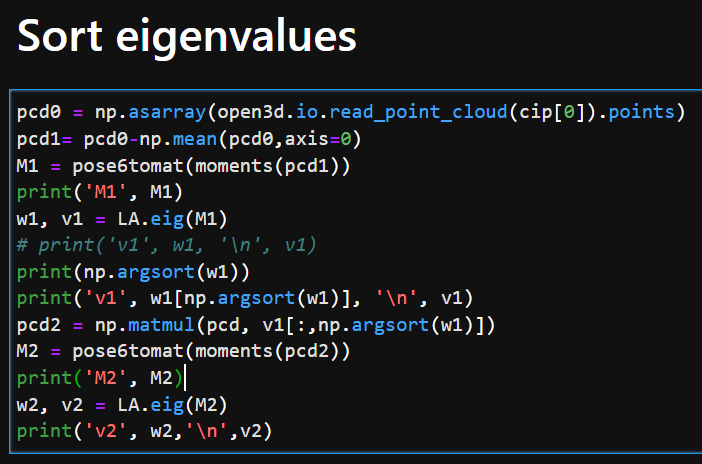
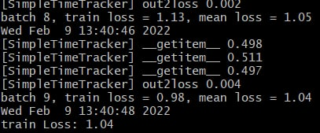
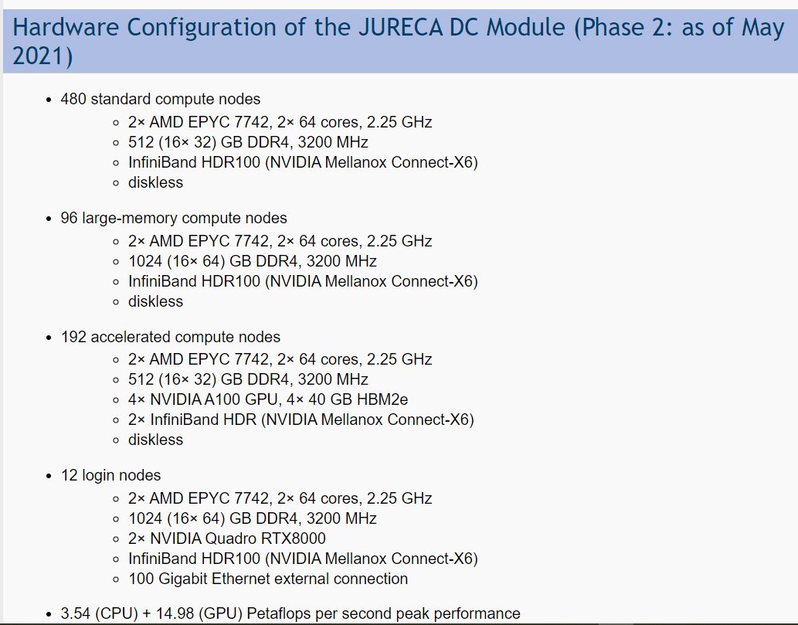

# Improved appearance 
- print out not only opt, but also parameters from argparse from the sh file
  - Split line using regexp, that every parameter name starts with a minus sign. If it is a binary parameter (there is the next parameter with a minus sign), then just paste True or False in the column of values
- Draw a vertical line to split mini-batches one from each other
- Enable single seed loss output
- 

# Resultative improvements
- Organize special files with different if-else conditions for every step in training: 
  * prepare input data 
  * preparing output data
  * prepare Dataset output
- Compare center of masses for first 2500 point clouds, if it makes sense to subtract mean for them
# Automate manual postprocessing
- Render multiple md files as a single (useful for long tables)
- Synchronize plot output between devices to consolidate them together, but ignore large files, like the model, vector output, etc. 
- 
# Tips from meeting on 21.12.2021
- Regress only 6 elements of the upper-triangular matrix, which contains information about the pose. For every seed calculate second moments (MatLab script for normalization on canonical view). For the other views, firstly rotate the point cloud at exactly 10 degrees.
- At this configuration, the axis of rotation is vertical, so that one pose angle is fixed, and the other is incremented for rotation. Then calculate the second-moment matrix. After that ask network to regress the pose directly from images, as just 6 values in the output. Alternatively, one can try to regress two angles directly.
- The next step is to include information about the center of masses of the point cloud, this will be additionally 3 parameters.
- After this works with small latent space like 2 or 4, increase shape space.
- Basis function should be smoother
- Check what is 0,0,0 of every point cloud. Is it not the camera center?
- What is the vector towards the center of masses?
- Try to output 9 seeds (3x3)
- Show seed with most elongated part
- Plot legend, what is ground truth, and what is model output
# Plan for 14.01, 15.01, 17.01
- Prepare update report for 17.01
- Automatize several things to make update reports faster
  - Find csv2md on python
  - Save as a postprocessing file with functions to produce output automatically
  - 
- 
# Update report
## e066/000w - Ground truth from original point cloud

POse ground truth are just moments (X*X, X*Y, ... , Z*Z), calculated from the original point cloud without subtracting the mean, and without calculating eigenvalues 

parameter | value
--- | :---:
bs|15
num_input_images|1
framelim|2000
rescale|500
cencrop|700
outputt|pose6
criterion|L1
lr|1e-4
hidden_dim|6
inputt|img
lb|pose6
zero_angle|
csvname|598csv9
parallel|torch
machine|workstation
.png)

## e066/001w
parameter | value
--- | :---:
bs|15
num_input_images|1
framelim|**2500**
rescale|500
cencrop|700
outputt|pose6
criterion|**L2**
lr|**5e-5**
steplr|**20, 0.2**
hidden_dim|6
inputt|img
lb|pose6
zero_angle|
csvname|598csv9
parallel|torch
machine|workstation
.png)

## e066/002w
parameter | value
--- | :---:
bs|15
num_input_images|1
framelim|**2500**
rescale|500
cencrop|700
outputt|pose6
criterion|**L2**
lr|**1e-3**
steplr|
hidden_dim|6
inputt|img
lb|pose6
zero_angle|
csvname|598csv9
parallel|torch
machine|workstation
.png)

## e066/005w - Ground truth is from point cloud with subtracted mean 
parameter | value
--- | :---:
bs|15
num_input_images|1
framelim|**2500**
rescale|500
cencrop|700
outputt|pose6
criterion|**L2**
lr|**1e-3**
hidden_dim|6
inputt|img
lb|pose6
zero_angle|
csvname|598csv9
parallel|torch
machine|workstation

.png)

.png)

.png)

## e066/046l
parameter | value
--- | :---:
epoch|**10**
bs|**7**
num_input_images|1
framelim|**25**
rescale|500
cencrop|700
outputt|pose6
criterion|**L2**
lr|1e-5
hidden_dim|6
inputt|img
lb|pose6
zero_angle|
gttype|single_f_n
csvname|598csv9
parallel|torch
machine|lenovo
Here I have spikes between iterations. The first iteration here means that the neural network has seen the first minibatch. Then the first and the second and so on. 

# Questions
- Every seed rotates relatively to the holder tip. How to find holder tip position for every seed? 
- There is a difference if calculate moments from the original point cloud or point cloud with subtracted mean. when I calculate mean, it already includes shape, because it depends on the shape, and center of masses is different from the tip position coordinate. The problem here is that I don't know the position of the tip in 3d or 2d. I only have camera center coordinates in 3d from the camera matrix. 
- For every rotation angle should I regress
  - pose separately for every angle, process every rotation as a new entry (data-point)
  - regress pose and then rotate it on the known angle, and then calculate loss from the GT
- Should I regress 6 values directly from moments (X*X, X*Y, ..., Z*Z), or calculate the rotation matrix from finding eigenvalues? 

# Hanno tips on 17.01.2022
- Reconstruct not (XX, XY, ..), because it depends on size, but orientation matrix, gained from the decomposition of this matrix. 
  - Check How many points of freedom it has. It should be only 3, , because 3 angle can describe every rotation. Another assumption, that the matrix is antisymmetrical. Is it? Or orthogonal?
  - Then try to add center of masses.
- Ask Andreas Fischbach to get the source code, how were point clouds generated. 
- If it find center and pose, it can do shape. Finally, 3D loss should include pose (and center of masses) loss
- Reread the article "What shape are dolphins". Classical fitting. 
  - Check how they track nose, flug, spine
- Check information about center of masses distribution, camera center distribution for the first 2500 seeds
- In 2. you may want to test, if using separate networks with shared weights -- one per image -- till the latent space and then joining them for pose regression may work better.

\

# TODO from 18.01.2022 till 24.01.2022
- **Done** Use decomposed eigenvalues matrix as ground truth for regression of the pose from images
- **Done** Treat every rotation image as separate datapoint
- **in progress** Regress pose and center of masses from images
  - Shift point cloud to have it projected with the same projection matrix on every corresponding image.
- using separate networks with shared weights -- one per image -- till the latent space and then joining them for pose regression
- 
  - 
***
#Update report for 24.01.2022

## What was done
- Implement work with multiple images with color and batch channel
- Sort eigenvalues in ascending order to save them in the same way for different seeds
- Multiply orientation matrix on sign of determinant, to have the same sign of the matrix for different seeds
- Find calculation error, when trying to get **arcsin** from 1.0000000001.
- Orientation matrix consisting of eigenvectors is orthogonal.

Algorithm for Euler angles calculation from point cloud
- Subtracting mean
- Calculating coefficients of quadric form (X*X, X*Y, .., Z*Z)
- Calculating eigenvalues
- Sort eigenvalues and return corresponding matrix of eigenvectors
- Optionally for multiple views: divide matrix of eigenvalues by rotation matrix of corresponding angle
- Calculate Euler angles from matrix of eigenvectors to use them for GT

Rotation matrix from projection matrix consists of just from rotation around angle beta. 

Angles of orientation distributed differently, but there is big group that takes majority of orientations. 

['C:/circles/finetune_test/main.py', '-epoch', '1000', '-bs', '15', '-num_input_images', '1', '-framelim', '2500', '-rescale', '500', '-cencrop', '700', '-criterion', 'L1', '-localexp', '', '-lr', '1e-4', '-expnum', 'e066', '-hidden_dim', '3', '-inputt', 'img', '-outputt', 'eul', '-lb', 'eul', '-minmax_fn', 'min,max', '-zero_angle', '-gttype', 'single_f_n', '-csvname', '598csv9', '-parallel', 'torch', '-machine', 'lenovo', '-wandb', '', '-merging_order', 'color_channel', '-updateFraction', '0.25', '-steplr', '1000', '1', '-batch_output', '2', '-cmscrop', '0', '-weight_decay', '0', '-print_minibatch', '1']

parameter | value
--- | :---:
inputt|   img 
num_input_images  |   1 
outputt  |   eul 
lb  |   eul 
minmax_fn  |   min,max 
framelim  |   2500 
criterion  |   L1 
lr|   1e-4 
hidden_dim  |   3 
zero_angle |
updateFraction  |   0.25 

## e067/008w
parameter | value
--- | :---:
inputt|   img 
num_input_images  |   **3**
outputt  |   eul 
lb  |   eul 
minmax_fn  |   min,max 
framelim  |   **-** 
criterion  |   **L2** 
lr|   1e-4 
hidden_dim  |   3
merging order | **color_channel**
updateFraction  |   0.25
ellapsed time | 10 hours

.png)

## e067/009w
parameter | value
--- | :---:
criterion | L1
lr | 1e-5
ellapsed time | 11 hours

## e067/010w
parameter | value
--- | :---:
num_input_images | 6
criterion | L1
ellapsed time | 1 day 7 hours

## e067/011w
parameter | value
--- | :---:
num_input_images | 12
criterion | L1
ellapsed time | in progress

# TODO from 24.01 to 31.01
- using separate networks with shared weights -- one per image -- till the latent space and then joining them for pose regression
- Regress pose and center of masses from images
  - Shift point cloud to have it projected with the same projection matrix on every corresponding image.

# Question to Hanno

- Does it make sense to regress ellipsoid from the images? Is it the same problem, as to regress 3 values for the pose, and 3 for the coordinate of the center
- Does it make sense to try regress pose from point cloud? It would be just a single matrix learn.

## Appendix

###TODO check that multiplication of rotation matrix C on orientation matrix will give the same result, as multiplication of C by point cloud. 

Sort eigenvalues to make them in ascending order. 

Multiply by determinant sign to make orientation uniform

For angle alpha there is weird plot 

 Measured statistic for rotation angles for 598: min, max, mean, std: 
 array([-3.14159265, 3.14159265, -0.31063423, 1.48487897])

Found that it is the same to first subtract mean and then rotate, or first rotate point cloud and then subtract mean. 

It is not the same, if calculate orientation matrix from rotated point cloud. 

- is it ok, or antidiagonal elements should be not the same
- Determinant of orientation matrix is -1

# Hanno's tips on 24.01
- Permute GT vectors, as NN can accidentially flip axes. 
- If regress eul angles, take into account peridiocity. That -pi = 0 = pi for directions.
  - if regress 3x3 orientation matrix, multiplication on -1 should be the same.
  - Look how found minimum angles between two rays.
  - Pay attention, that eigenvectors is not orientation. We need orientation, not direction. So ray has two ends. 
- When evaluate model and regress 3x3 matrix, estimate closest orthogonal vector basis, because model output is not orthogonal
  - Calculate closest orthogonal during training can be computationally expensive
- Treat independent datapoints (in batch channel). Concatenate output of the network in last convolutional output of the network. Or in the first FC layer. Add additional FC layer of size 32 or 128, for example. 
- For ellipsoid fitting, read Direct least square fitting of ellipses https://ieeexplore.ieee.org/document/765658

# Update report for 31.01.2022

Applied augmentation:
- Multiply 3x3 orientation matrix on -1. 
- Permute columns
- Calculate the closest set of vectors, making an orthonormal matrix. 

`  peridx = np.array([[0, 1, 2], [0, 2, 1], [1, 0, 2],
            [1, 2, 0], [2, 0, 1], [2, 1, 0]])`

    outputs2 = t.matmul(t.svd(outputs[j, :,:])[0], t.svd(outputs[j, :, :])[2].T)
    for i in range(12):
        outputs3 = (-1) ** (i % 2) * outputs2[:, peridx[i // 2, :]]

It takes 0.1 seconds for minibatch with size 5 and 3 views to calculate validation loss with augmentation. 
# e067/016w
parameter | value
--- | :---:
bs | 15
'-num_input_images' | '3'
'-framelim' | '6000'
'-criterion' | 'L2'
'-lr' | '1e-4'
'-hidden_dim' | '9'
'-inputt' | 'img'
'-outputt' | 'orient'
'-machine' | 'workstation'
'-merging' | 'color'
'-updateFraction' | '0.25'
'-aug_gt' | 'orient'
['-epoch', '40', '-bs', '15', '-num_input_images', '3', '-framelim', '6000', '-criterion', 'L2', '-localexp', '', '-lr', '1e-4', '-expnum', 'e067', '-hidden_dim', '9', '-inputt', 'img', '-outputt', 'orient', '-lb', 'orient', '-no_loadh5', '-minmax_fn', '', '-parallel', 'torch', '-machine', 'workstation', '-merging', 'color', '-aug_gt', 'orient', '-updateFraction', '0.25', '-steplr', '1000', '1', '-print_minibatch', '10', '-dfname', '598frame']

~~Validation loss is around 0.02~~ - **it is mistake, validation loss is higher**
Minimum training loss is 0.315. 

.png)

## Experiments on jureca
- Learning rate [1e-7, 5e-7, 1e-6, 5e-6, 1e-5, 5e-5, 1e-4, 5e-4, 1e-3, 5e-3]
- Num_input_images [3, 6, 9, 12, 15, 18, 21, 24, 27, 30, 36]
- Batch size [15, 20, 25, 30, 35, 40, 45, 50, 100, 200]
- [L1, L2] * [batch_merging, color_merging] * [update_fraction = 0.1, update_fraction = 0.25]

Typical learning curve

Here validation loss is not correct!!! It was mistake with minimazing loss. 

Minimum train is around 0.3, validation is around 0.02. 

## Failed experiments
### lr = 5e-3
.png)
### lr = 1e-3
.png)

### lr = 5e-4
.png)

### lr = 5e-5, update_fraction decreased from 0.25 to 0.1
.png)

### lr = 5e-5, update_fraction is decreased from 0.25 to 0.1, loss_fn changed from L2 to L1
.png)

For experiment with multiple views, one should decrease batch size, otherwise there are not enough memory
# TODO
- Copy name of the sh file to the output folder to stop saturated training
- How to save output loss figure when using multiple GPUs?
- Write callback to automatically stop saturated training
- automatically delete folders with failed experiments
- Save and synchronize loss using numpy savetxt.
- Run experiment, 
  - if with more images I have better regression of the pose
  - If increasing size of one before last FC layer is better
  - Try to regress center of masses.
# Questions to Hanno:
- Can I just use min((loss(outputs, GT), loss(outputs, -GT))) in validation?
- Should I use fixed augmentation for validation loss calculation or it is free? 
- Writing a report for JSC
- How to technically share weights?
- When regress center of mass, should I also include loss for the pose?
- Whom to ask to optimize script to work on multiple GPUs?
- 
# Plan from 01.02 till 07.02
- Regress centers of masses
- Modify FC layer size for pose regression

scaling and 
Scaling matrix by factor of 2, keep other fixed, S = diag(2, 1, 1)
Point x is being 3d point, coordinate system of the camera, 
seed is not oriented in camera direction, but rotated. 
If we have this scaling, to calculate x', that x'= R.T * S * R * x, 
vector x is projected to the three unified vectors of coordinate system of the seed. X is diagonal matrix, we require main axis of the seed to be the first eigenvalue of that matrix, the first horizontal vector in R. Is coordinate vector along the main axis of the seed. 

R is horizontal vectors, three horizontal vectors, Unit vectors, the vector, they are unit length. 
R*x is the projection to the new eigensystem. Then it is scaling, (multiply by S), then transform back.
R for rotation
R 

Requirements for 
- right handed / left
- positive half-space
Vectors of rotation.
- .X is vertical 
- If it is on the unit sphere, it should be les than 1. If vector is in the positive half-space, the sign. 
- X component is positive. Flip the whole vector if it is negative. 
- The same test. If the first is not positive, flip. 
- For the third right handed eigensystem. 
- cross product of the first two, then scalar product of the x3, if it is not negative projection 
v = (x3, [x1, x2]). if v is positive, keep x3 as is, and if v is negative, flip. 

# Hanno's tips 31.01.2022
- Flip vectors separately from each other, not the multiplication of the whole matrix by -1. 
- Take care when it is close to the flipping point. Check sign of projection (x3, [x1, x2]) in order to decide flip sign or not. 
- Check, whether validation loss is smaller if use only sign flip. One can flip signs every time depending on the output of the NN. 
- In order to get rid of values more than one, use tanh on the last layer, that actual output will be always at [-1, 1] range.
- Fix vector order. 
- Seeds are flat. Make sure that training data only contain flat systems. Test on only that quite distinguishable. 
- Find a better way to show density of points. Because if point size is big enough, one cannot see difference. 

# Organizational stuff 31.01.2022
- About Informatics course
  - Dokumentation zum promotionsvorhaben, Auflagenzum promotionszulassung
  - Say how much compute time for me was used?
  - Does it include exams? Is there minimum requirement on pass or fail, or just pass better than something
  - Courses are labeld to be kernbereich to Informatik
- Send kindly reminder to Leif, Klin, Möbius, or sekretariat i8, whether I could attend meetings
- Report for JSC:
  - For section 2: 
    - Not list of configuration, high level description, what it is configuration about. 
    - Compute time is less than we applied for, because we have more things to investigate in the future.
    - Data preparation ; we are done with that
  - For section 4 
    - Convolutional nn is low depth, loss function, how to deal latent space.
    - How many run is it, do I need to make a grid search. Before it comes a grid search with early stopping. (or 20)
10 epochs or 100 epochs before real experiment. Typical settings
    - number of cores used: parallelization is not a big deal, I used horovod for parallelization, but typical experiment running on a single node is sufficient.  I should explain, that I did not overly spend computing time, but used it in reasonable manner.
    - For the final run we need more than for testing, because there we will use whole data and more epochs. 
    - Code modification for us will be suitable neural network architecture. But now we know, what works better. 
    - Granted computing time is not fully used, because we didn’t really start with cassava roots, but worked with seeds
    - If needed, jobs are ready to be launched.

#Plan for week from 1.02.2022 till 7.02.2022
- Write report for JSC
- Test validation augmentation on jureca
- Deliver documents to Dekanat 1
  - Ask whether it is enough to send just translation without official letter from notar
- **done** Register for RWTH
- Regress centers of masses
- Modify FC layer size for pose regression
- Write email to Leif's postdocs, that I would like to participate in their seminar as well.

There are different results for minibatches. Some of them have loss around 0.02, and other can be 0.4 - 0.5. And even more, they alternate each other.

# Questions to Hanno:
- can I measure accuracy in IoU or Chamfer distance, when performing a regression of point cloud?
- What does it mean? **Due to the implicit nonlinear restrictions enforced by model knowledge in the renderer, we expect slower and less reliable convergence in the training phase.** 
- What does mean **Investigate suitable handling of 3d information in DNN-based model regression.**? 
- Plans about 3d root with generalized cylinders. I won’t use an OpenSimRoot because it does not produce comparable photorealistic results. Instead, produce a depthmap in the output of the neural network, and compare it with the ground truth depth map. 
- Will I work on Arabidopsis or just skip this section? roots after seeds?
- Will I work on NeRF?
- Should I repeat experiment with scalability and calculate dataset size and wall clock time on my dataset with 5k seeds?
- Should this proposal be aligned with phd proposal **doktoranden vorschlag**? 
- However, when multiple images need to
be processed in parallel as usual for SfM model-parallel multi-GPU implementations may be needed. 
- For coordinate-based neural representations we will investigate the regularizing effect of learning initializations together with supplemental supervised outputs, e.g.\ object masks, promoting cleaner surfaces. We expect that this will allow for accurate reconstruction, also in scenes where not all object parts are visible
- Dataloader: all information about one seed in h5 file? or one h5 file for the whole dataset, for example 6k seeds?
- Should I use hyperopt for hyperparameters searching or just grid search for beginning?
- From phenoseeder I have 32k seeds with 36 views and point cloud available, not 10k. 
- Why is one image of a seed is 5 MPix? ROI should be 700*700*1.8 = 0.88 MPix.   
- How to calculate, how much pixels is in point cloud? 
- Why 100 seeds are sufficient? I have overfitting even with 5000 seeds. 

## TODO
- synchronize run of the script with github commit in order to be able to reproduce the same result. Or do it manually after succesfully launched code, with noting experiment number. 
- Print dummy output before first epoch in order to check that output will work as intended
- Use intersection over union or chamfer distance to evaluate 3d reconstruction accuracy. 
- Understand, what does it mean, error in 0.5 for coefficient calculation. 
- There is no information on what is accuracy for regression of spherical harmonics. Should it be measured in terms of accuracy of 3d reconstruction? 

## TODO proposal
- Update preliminary work, include results of report
- Insert in project report about problem that camera center and reconstructed point cloud are not the same for all seeds

Distribution of volumes enclosed by parallelepiped, gained from limits of point clouds. 

Volumes from 5283 seeds are 522499 plus minus 131024. Approximately it is 523000 plus minus 131000 voxels. 
Approx it is 5e5 plus minus 1e5. 

There are 30699 seeds overall in phenoseeder folder, that contains 36 rotation images. 

## Hanno's tips on 07.02.2022
- Use jureca to run code overnight. 
- If run multiple jobs, it is better to run smaller projects, because I don't need to wait till more nodes will be free
- Use multiple nodes, because after 24 hours it will be stopped
- 
# Period 08.02.2022 to 14.02.2022
- **done** Test validation augmentation on jureca
- Deliver documents to Dekanat 1
  - Ask whether it is enough to send just translation without official letter from notar 
- Regress centers of masses
- Modify FC layer size for pose regression
- Write email to Leif's postdocs, that I would like to participate in their seminar as well.

- 

## Results
Ablation, if not use all of augmentations, validation is increasing up to 0.64. 

Loops for augmenetaion takes 0.3 seconds for every minibatch, consisting of 5 images, 3 view each 

Huge amount on time spending on dataloading, and it is not synchronized in parallel with training loop: 

Dataset 598 consists of 216 Gb, there are 5283 * 36 images, each with resolution 1000 * 1800. One image takes approx. 1 Mb. 

Training loop for 3 views, 5200 seeds, 5*3 size of minibatch takes 1380 seconds. Parallel is default torch, machine is workstation. 

### Regression of orientation matrix. Testing learning rate on dataset of 500 seeds, 3 view per seed, merging views in batch channel
['../../main.py', '-datapath', 'D:/cherepashkin1/phenoseed/', '-realjobname', 'e074w017.sh', '-jobname', 'e074w021.sh', '-jobdir', '', '-expnum', 'e074', '-epoch', '100', '-bs', '5', '-num_input_images', '3', '-framelim', '500', '-criterion', 'L2', '-rmdirname', '-lr', '1e-6', '-hidden_dim', '32', '9', '-inputt', 'img', '-outputt', 'orient', '-lb', 'orient', '-no_loadh5', '-minmax_fn', '', '-parallel', 'torch', '-machine', 'workstation', '-merging', 'batch', '-aug_gt', '', '-updateFraction', '0.25', '-steplr', '1000', '1', '-print_minibatch', '10', '-dfname', '598frame']

**lr = 5e-5**

**lr = 1e-5**

**lr = 5e-6**

**lr = 1e-6**

The next experiment will be whether my experiments are repeatable. Just fix learning rate at 1e-4 and repeat three times.

## Higher learning rate (1e-4) leads to overfitting 

.png)

Jureca 8 nodes, 4 GPU each takes 9 seconds to process an epoch, consisting of 500 seeds, 3 views each. Parallel with horovod, num_worker = 0. 48s for completing the whole script. Means 48s - 5*9s = 3 s for data preparation and output.
For 4 nodes it is 16 seconds per epoch. 

number of nodes | time per epoch, seconds
--- | :---:
8 | 9
4 | 16
2 | 26
1 | 48

Jureca 8 nodes, 4 GPU each takes 76 seconds to process an epoch, consisting of 500 seeds, 36 views each. 500 seeds = 400 seeds for train and 100 seeds for validation. batchsize = 1. 

Estimated time, that I need 220 seconds to process an epoch, 500 seeds, 36 views, on 8 jureca GPU.

In the proposal it is written, that for 500 seeds, 36 views, I need 314 seconds with 8 jureca GPUs. 

Comparison between single GPU workstation and jureca 8 GPU. Jureca 8 GPU is 8.8 times faster than single GPU of workstation.

Experiments run on workstation are completely repeatable. 

## Questions to Hanno
- How technically it is usually creating dataset? Should it be equal to RAM?
- Does it make sense to test training on small dataset, like 100 or 500 seeds instead of 5300? Can I see that network is training and gives meaningful output if testing on only 500 seeds?
- In reality, should I use multiple nodes, if it is sufficient to use single node in less than 24 hours? 
- Why is initialization jumps between different runs, and how to fix it?
- Why do I have so small loss for one of the minibatches, not like the other minibatches? 

## In Jülich
- Give bike and helmet back
- **done** Take hdd

## TODO from 31.01 till 07.02
- **done** there is delay between epochs
- check computational time on jureca, what part is slow
  - check distributed loading with num workers
- gather all results to one place together with configuration file in order to compare them.
- Figure out, why validation loss is low in the beginning. It is 0.13, although before it was 0.6. 
- Test whether another algorithm to load h5 is efficient.
- 16GPix for compute time calculations. Training a small network on 32GPUs with 16GPix takes XXXs wall clock time, i.e.\ XXXh. We assume to need 100 epochs, i.e.\ XXXh per run. 
- Optimize that on jureca trainit should be only done once on rank==0, and copyied to all the other ranks. 
- Count, how much runs and for how many epochs did I have in general
- Save every epoch, how much time did I spent so far and what is the size of the dataset, and how many views in order to count computing time.
- Insert to excel file all results of experiments, and make results of experiments comparable
- Calculate computing speed of lenovo thinkpad. 
- Insert tanh as argparse parameter
- Check why is for some minibatches loss is much lower, 
  - how seeds look like for this minibatch?
  - are they preserved accross epochs?
- Why does center of masses can't do better than 0.22?  
- Save output log to output directory. 
## TODO for period from 14.02 to 21.02
- check distributed loading with num workers
- Test whether another algorithm to load tif images is efficient.
- Save every epoch, how much time did I spent so far and what is the size of the dataset, and how many views in order to count computing time.
- - Check why is for some minibatches loss is much lower, 
  - how seeds look like for this minibatch?
  - are they preserved accross epochs?
- - Why does center of masses can't do better than 0.22?  
## Tips from Hanno on 14.02
- ~~MUST-HAVE!!! Write to Leif's group to participate in group meeting, go on coffee breaks and work with them~~
- Regress main axis. Instead of three angels, output only single angle in for of 3-value vector. 
- Use full power of 36 images, make a ground truth for every of them and treat as separate data entries. UPDATE - 
  - it seems to be that it does not matter, how much input images there are, because all learning is only in the first epoch. 
- Use loss augmentation for both training and val, or not use at all. 
  - Calculate augmentation in advance to not spend time on it further. 
- Read about different precision of operations, like single, float in terms of speed up for GPU. 
- Calculate loss output in degree, to have sense how to evaluate loss. 
- ~~Calculate validation and train before first epoch, in order to see from what start with.~~
- Load whole dataset to GPU. 
  - Check if it will be processed faster, because early stoping and only 10 epochs can be equally as load during the training
- Run multiple experiments with small resolution of image on single GPU. Because Jureca has 40 Gb GPUs. 
  - Ask Alessio. 
  - Use slurm to spawn jobs
  - Use python spawn
- Try to use full load of the GPU. Check GPU utilization during the trainig. It can happen that GPU can't process full minibatch in a single run. Then it is used only 50% of GPU, because it waits until small additional piece of data is processed.
- When see augmentation, reduce fully connected part, increase dataset size. Tweak lr if thing does not converge. 
- Check that problem that some mini-batches have lower loss than another. Check that their orientation matrix GT is closer to unity matrix or something like that, and model output is also close to unity matrix. 
  - Check that output of the network are different from each other. 
- 
---
## Plan for 15.02
- ~~Write email to Leif~~
- ~~Send documents to Ausländeramt~~
- ~~Check RWTH email~~
- Check if increasing number of views increase accuracy of coefficient regression
- Publish issues on jugit
- ~~Output validation first~~
- Calculate loss figure in degree, not in coefficient
- ~~Gather results from e074/026 - 028~~
- Check whether neural network learns something at all after first epoch. Maybe the minimal loss is already after the first epoch.
- Check whether network output different from each other. 
- Register for english course
- Write Allesio about multiprocess on one GPU
- Write Jim about hdf5 dataloader
- Change dataloader that way, to load whole dataset into RAM at once
- How to change size of a picture in markdown
- For every experiment calculate minimum train and val loss, and epoch when it happens. 
- Modify function sf that it save notebook, from what it is originated
- Print date and number of experiment on the plot
- Check why validation loss does not go down with training
- Read book that Hanno shared with me !
- Check that the input corresponds to the output

## TODO for period from 14.02 to 21.02
- Consolidate different texts about my project from
  - PhD seminar
  - Compute time proposal
  - Linkedin
  - Doktorandenvorschlag

## Results 

If using training without tanh, it can't reach loss as it was before. 

['../../main.py', '-datapath', 'D:/cherepashkin1/phenoseed/', '-realjobname', 'e074w019.sh', '-jobname', 'e074w026.sh', '-jobdir', '', '-expnum', 'e074', '-epoch', '100', '-bs', '5', '-num_input_images', '3', '-framelim', '500', '-criterion', 'L2', '-rmdirname', '-lr', '1e-5', '-hidden_dim', '32', '9', '-inputt', 'img', '-outputt', 'orient', '-lb', 'orient', '-no_loadh5', '-minmax_fn', '', '-parallel', 'torch', '-machine', 'workstation', '-merging', 'batch', '-aug_gt', '', '-updateFraction', '0.25', '-steplr', '1000', '1', '-print_minibatch', '10', '-dfname', '598frame']

Min of val: 
array([0.34933934, 0.33896489, 0.33958282])
Min of train:
array([0.38737675, 0.36118946, 0.36636513])
Argmin of val:
[0, 0, 0]

### Consolidated results from previous experiments on orientation

On workstation there enough capacity when train with rescale 200, 36 images, 8 seeds. 

